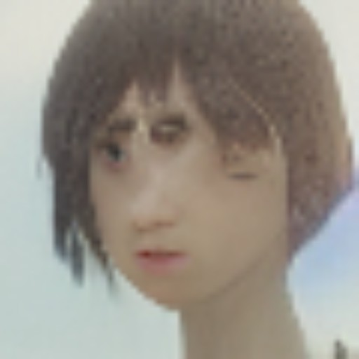
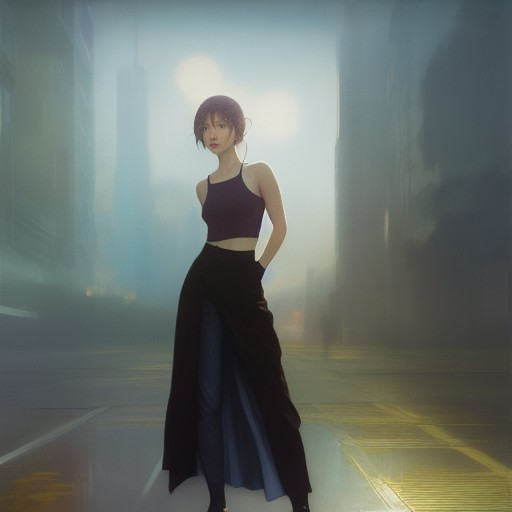
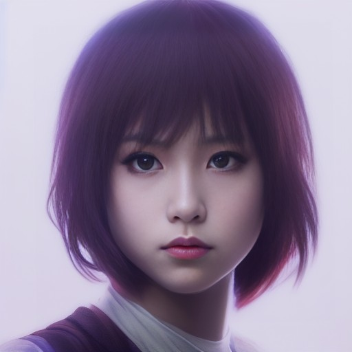
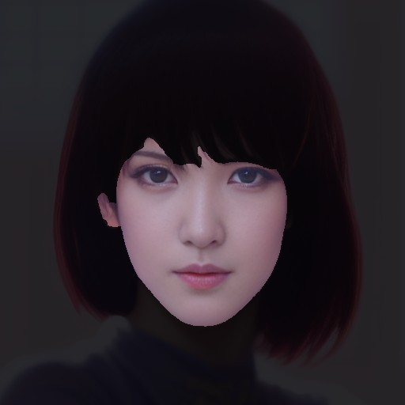
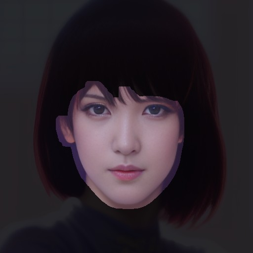

# Face Editor
Face Editor for Stable Diffusion.
It can be used to repair broken faces in images generated by Stable Diffusion.

This is a [custom script](https://github.com/AUTOMATIC1111/stable-diffusion-webui/wiki/Custom-Scripts#installing-and-using-custom-scripts) of [AUTOMATIC1111's Stable Diffusion Web UI](https://github.com/AUTOMATIC1111/stable-diffusion-webui).

## Setup
Copy [face_editor.py](./scripts/face_editor.py) into **scripts** directory of stable-diffusion-webui and restart the web ui.

## Usage
This script is used in the **img2img** tab of the web ui.

### 1. Open the image to be edited in the img2img tab
It is recommended that you use the same settings (prompt, sampling steps and method, seed, etc.) as for the original image. 
So, it is a good idea to start with the **PNG Info** tab.

1.  Click **PNG Info** tab.
2.  Upload the image to be edited.
3.  Click **Send to img2img** button.
4.  Upload the image in the **img2img** tab again.

### 2. Open Face Editor and Generate
1.  In the img2img tab, select **Face Editor** script.
    
2.  Set [parameters](#parameters).
3.  Click **Generate** button.

If you are not satisfied with the results, adjust the parameters and rerun.

## How it works
This script performs the following steps:

### Step 1
Detects faces on the image.

### Step 2
Crop the detected face image and resize it to 512x512.

### Step 3
Run **img2img** with the image to create a new face image.

### Step 4
Resize the new face image and paste it at the original image location.

### Step 5
To remove the borders generated when pasting the image, mask all but the face and run **inpaint**.

### Completed

## Parameters
### Maximum number of faces to detect (1-20)
Use this parameter when you want to reduce the number of faces to be detected.
If more faces are found than the number set here, the smaller faces will be ignored.

This is the parameter for [step-1](#step-1).

### Face detection confidence (0.7-1.0)
Confidence threshold for face detection. Set a lower value if you want to detect more faces.

This is the parameter for [step-1](#step-1).

### Face margin (1.0-2.0)
Specify the size of the margin for face cropping by magnification.

If other parameters are exactly the same but this value is different, the atmosphere of the new face created will be different.

This is the parameter for [step-2](#step-2).

### Prompt for face
Prompt for generating a new face.
If this parameter is not specified, the prompt entered at the top of the screen is used.

This is the parameter for [step-3](#step-3).

### Denoising strength for face images (0.1-0.8)
Denoising strength for generating a new face.
If the value is too small, facial collapse cannot be corrected, but if it is too large, it is difficult to blend with the entire image.

**strength: 0.4**

**strength: 0.6**

**strength: 0.8**

This is the parameter for [step-3](#step-3).

### Mask size (0-64)
Size of the mask area when inpainting to blend the new face with the whole image.

**size: 0**

**size: 10**

**size: 20**

This is the parameter for [step-5](#step-5).

### Mask blur
Size of the blur area when inpainting to blend the new face with the whole image.

This is the parameter for [step-5](#step-5).

### Denoising strength for the entire image
Denoising strength when inpainting to blend the new face with the whole image.

This is the parameter for [step-5](#step-5).

