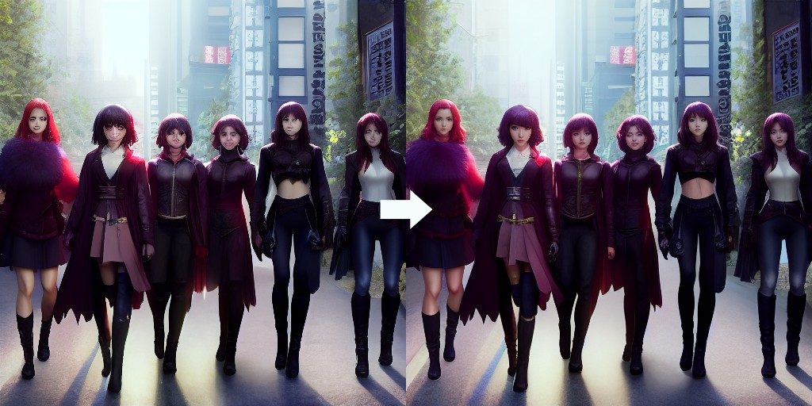
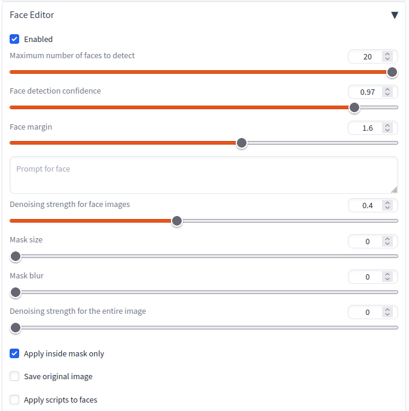
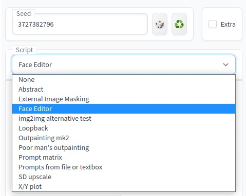

# Face Editor
Face Editor for Stable Diffusion.
It can be used to repair broken faces in images generated by Stable Diffusion.



This is a [extension](https://github.com/AUTOMATIC1111/stable-diffusion-webui/wiki/Extensions) of [AUTOMATIC1111's Stable Diffusion Web UI](https://github.com/AUTOMATIC1111/stable-diffusion-webui).

This software improves facial images in these features:
- txt2img
- img2img
- batch processing (batch count / batch size)
- img2img Batch

## Setup
1. Open the "Extensions" tab then the "Install from URL" tab.
2. Enter "https://github.com/ototadana/sd-face-editor.git" in the "URL of the extension's git repository" field.
   
3. Click the "Install" button and wait for the "Installed into /home/ototadana/stable-diffusion-webui/extensions/sd-face-editor. Use Installed tab to restart." message to appear.
4. Go to "Installed" tab and click "Apply and restart UI".


## Usage
1. Click "Face Editor" and check "Enabled".
   
2. Then enter the prompts as usual and click the "Generate" button to modify the faces in the generated images.
   
3. If you are not satisfied with the results, adjust the [parameters](#parameters) and rerun. see [Tips](#tips).


## Tips
### Recommended settings
Please try the following settings first:

- Set the **"Mask size"** to `0`.
- Check **"Apply inside mask only"**
- Set the **"Mask blur"** to `12`.
- Set the **"Denoising strength for the entire image"** to `0`.



### Contour discomfort
If you feel uncomfortable with the facial contours, try increasing the **"Mask size"** value. This discomfort often occurs when the face is not facing straight ahead.


### When multiple faces are close together
When multiple faces are close together, one face may collapse under the influence of the other.
In such cases, enable **"Use minimal area for face selection"**.


### Change facial expression
Use **"Prompt for face"** option if you want to change the facial expression.


### Fixing images that already exist
If you wish to modify the face of an already existing image instead of creating a new one, follow these steps:

1. Open the image to be edited in the img2img tab
   It is recommended that you use the same settings (prompt, sampling steps and method, seed, etc.) as for the original image. 
   So, it is a good idea to start with the **PNG Info** tab.
   1. Click **PNG Info** tab.
   2. Upload the image to be edited.
   3. Click **Send to img2img** button.
2. Disable Face Editor extension  
   Here, script is used instead of extension.
   Therefore, turn off the "Enabled" checkbox in the Face Editor extension.
3. Open Face Editor script and Generate
   1. In the img2img tab, select **Face Editor** script.
    
   2. Click **Generate** button.

## How it works
This script performs the following steps:

### Step 0
First, image(s) are generated as usual according to prompts and other settings. This script acts as a post-processor for those images.

### Step 1
Detects faces on the image.


### Step 2
Crop the detected face image and resize it to 512x512.


### Step 3
Run **img2img** with the image to create a new face image.


### Step 4
Resize the new face image and paste it at the original image location.


### Step 5
To remove the borders generated when pasting the image, mask all but the face and run **inpaint**.


### Completed


## Parameters
### Maximum number of faces to detect (1-20)
Use this parameter when you want to reduce the number of faces to be detected.
If more faces are found than the number set here, the smaller faces will be ignored.

This is the parameter for [step-1](#step-1).

### Face detection confidence (0.7-1.0)
Confidence threshold for face detection. Set a lower value if you want to detect more faces.

This is the parameter for [step-1](#step-1).

### Face margin (1.0-2.0)
Specify the size of the margin for face cropping by magnification.

If other parameters are exactly the same but this value is different, the atmosphere of the new face created will be different.


This is the parameter for [step-2](#step-2).

### Use minimal area for face selection
When pasting the generated image to its original location, the rectangle of the detected face area is used. If this option is not enabled, the generated image itself is pasted. In other words, enabling this option applies a smaller face image, while disabling it applies a larger face image.

This is the parameter for [step-4](#step-4).

### Size of the face when recreating 
Specifies one side of the image size when creating a face image. Normally, there should be no need to change this from the default value (512), but you may see interesting changes if you do.

This is the parameter for [step-3](#step-3).

### Ignore faces larger than specified size
Ignore if the size of the detected face is larger than the size specified in "Size of the face when recreating".

This is the parameter for [step-1](#step-1).

For more information, please see: [here](https://github.com/ototadana/sd-face-editor/issues/65).

### Prompt for face
Prompt for generating a new face.
If this parameter is not specified, the prompt entered at the top of the screen is used.

This is the parameter for [step-3](#step-3).

### Denoising strength for face images (0.1-0.8)
Denoising strength for generating a new face.
If the value is too small, facial collapse cannot be corrected, but if it is too large, it is difficult to blend with the entire image.

**strength: 0.4**


**strength: 0.6**


**strength: 0.8**


This is the parameter for [step-3](#step-3).

### Mask size (0-64)
Size of the mask area when inpainting to blend the new face with the whole image.

**size: 0**


**size: 10**


**size: 20**


This is the parameter for [step-5](#step-5).

### Mask blur (0-64)
Size of the blur area when inpainting to blend the new face with the whole image.

This is the parameter for [step-5](#step-5).

### Denoising strength for the entire image (0.0-1.0)
Denoising strength when inpainting to blend the new face with the whole image.
If the border lines are too prominent, increase this value.

This is the parameter for [step-5](#step-5).

### Apply inside mask only
Paste an image cut out in the shape of a face instead of a square image.

This is the parameter for [step-4](#step-4).

For more information, please see: [here](https://github.com/ototadana/sd-face-editor/issues/33).

### Save original image
Specify whether to save the image before modification.

For more information, please see: [here](https://github.com/ototadana/sd-face-editor/issues/7#issuecomment-1505091410).

### Show intermediate steps
Specifies whether to display images of detected faces and masks.


## API
If you want to use this script as an extension (alwayson_scripts) in the [API](https://github.com/AUTOMATIC1111/stable-diffusion-webui/wiki/API), specify **"face editor ex"** as the script name as follows:

```
    "alwayson_scripts": {
        "face editor ex": {
            "args": [{"prompt_for_face": "smile"}]
        },
```

- By specifying an object as the first argument of args as above, parameters can be specified by keywords.
- See [source code](https://github.com/ototadana/sd-face-editor/blob/main/scripts/face_editor_extension.py) for available keywords

For more information, please see: [here](https://github.com/ototadana/sd-face-editor/issues/57).
