# Face Editor
Face Editor for Stable Diffusion. This Extension is useful for the following purposes:

- Fixing broken faces
- Changing facial expressions
- Apply blurring or other processing

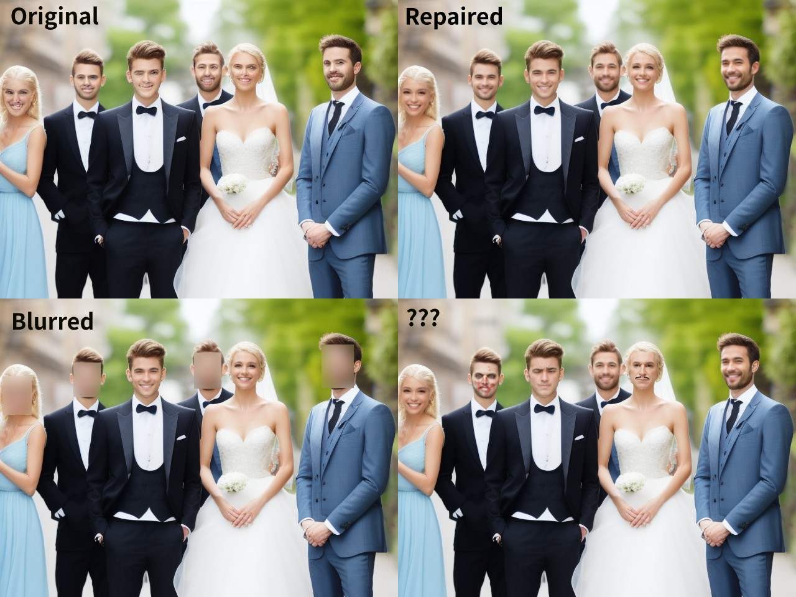

This is a [extension](https://github.com/AUTOMATIC1111/stable-diffusion-webui/wiki/Extensions) of [AUTOMATIC1111's Stable Diffusion Web UI](https://github.com/AUTOMATIC1111/stable-diffusion-webui).

## Setup
1. Open the "Extensions" tab then the "Install from URL" tab.
2. Enter "https://github.com/ototadana/sd-face-editor.git" in the "URL of the extension's git repository" field.
   
3. Click the "Install" button and wait for the "Installed into /home/ototadana/stable-diffusion-webui/extensions/sd-face-editor. Use Installed tab to restart." message to appear.
4. Go to "Installed" tab and click "Apply and restart UI".


## Usage
1. Click "Face Editor" and check **"Enabled"**.
   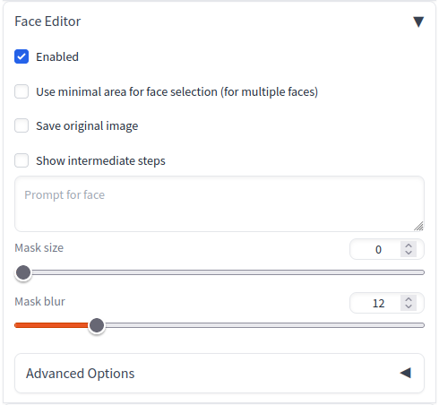
2. Then enter the prompts as usual and click the "Generate" button to modify the faces in the generated images.
   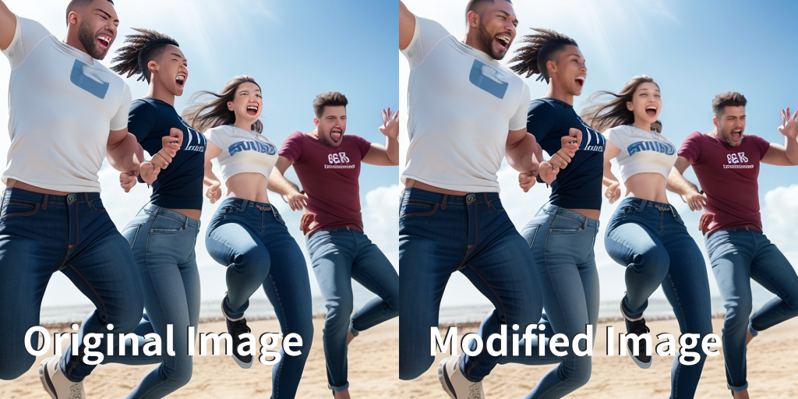
3. If you are not satisfied with the results, adjust the [parameters](#parameters) and rerun. see [Tips](#tips).


## Tips
### Contour discomfort
If you feel uncomfortable with the facial contours, try increasing the **"Mask size"** value. This discomfort often occurs when the face is not facing straight ahead.

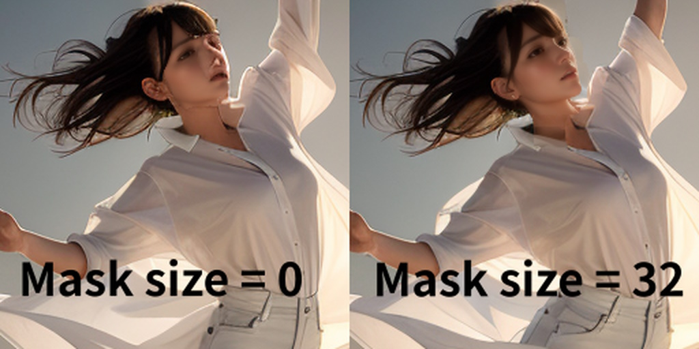

If the forelock interferes with rendering the face properly, generally, selecting "Hair" from **"Affected areas"** results in a more natural image.

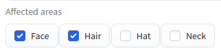

This setting modifies the mask area as illustrated below: 


---
### When multiple faces are close together
When multiple faces are close together, one face may collapse under the influence of the other.
In such cases, enable **"Use minimal area (for close faces)"**.

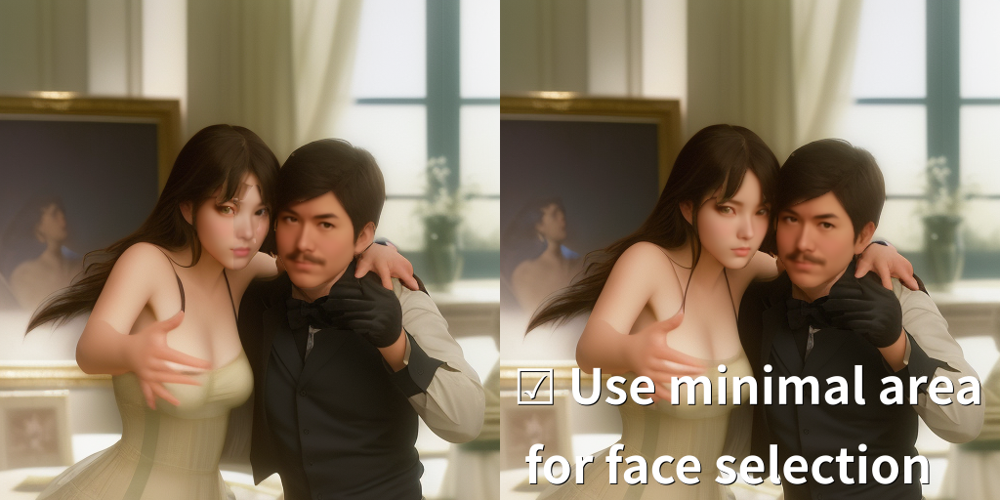

---
### Change facial expression
Use **"Prompt for face"** option if you want to change the facial expression.

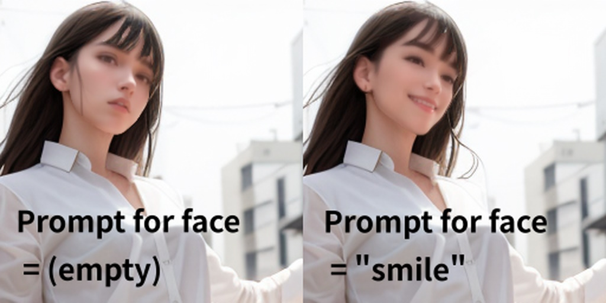

#### Individual instructions for multiple faces
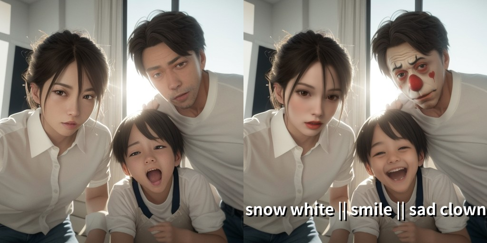

Faces can be individually directed with prompts separated by `||` (two vertical lines).

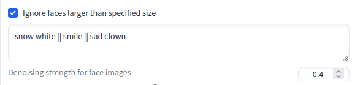

- Each prompt is applied to the faces on the image in order from left to right.
- The number of prompts does not have to match the number of faces to work.
- If you write the string `@@`, the normal prompts (written at the top of the screen) will be expanded at that position.
- If you are using the [Wildcards Extension](https://github.com/AUTOMATIC1111/stable-diffusion-webui-wildcards), you can use the `__name__` syntax and the text file in the directory of the wildcards extension as well as the normal prompts.

---
### Fixing images that already exist
If you wish to modify the face of an already existing image instead of creating a new one, follow these steps:

1. Open the image to be edited in the img2img tab
   It is recommended that you use the same settings (prompt, sampling steps and method, seed, etc.) as for the original image. 
   So, it is a good idea to start with the **PNG Info** tab.
   1. Click **PNG Info** tab.
   2. Upload the image to be edited.
   3. Click **Send to img2img** button.
2. Set the value of **"Denoising strength"** of img2img to `0`. This setting is good for preventing changes to areas other than the faces and for reducing processing time.
3. Click "Face Editor" and check "Enabled".
4. Then, set the desired parameters and click the Generate button.

---
## How it works
This script performs the following steps:

### Step 0
First, image(s) are generated as usual according to prompts and other settings. This script acts as a post-processor for those images.

### Step 1. Face Detection
<details>
<summary>Detects faces on the image.</summary>

   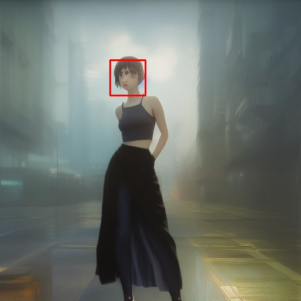
</details>


### Step 2. Crop and Resize the Faces
<details>
<summary>Crop the detected face image and resize it to 512x512.</summary>


</details>

### Step 3. Recreate the Faces
<details>
<summary>Run <b>img2img</b> with the image to create a new face image.</summary>

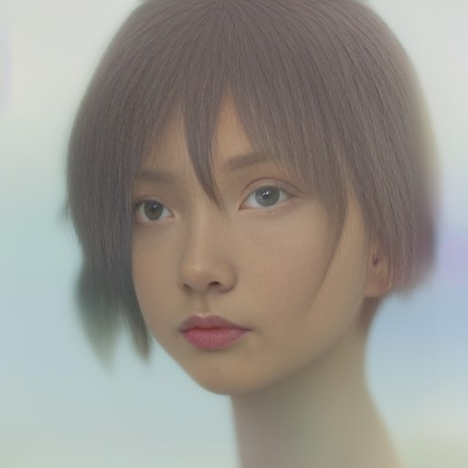
</details>

### Step 4. Paste the Faces
<details>
<summary>Resize the new face image and paste it at the original image location.</summary>


</details>

### Step 5. Blend the entire image
<details>
<summary>To remove the borders generated when pasting the image, mask all but the face and run <b>inpaint</b>.</summary>

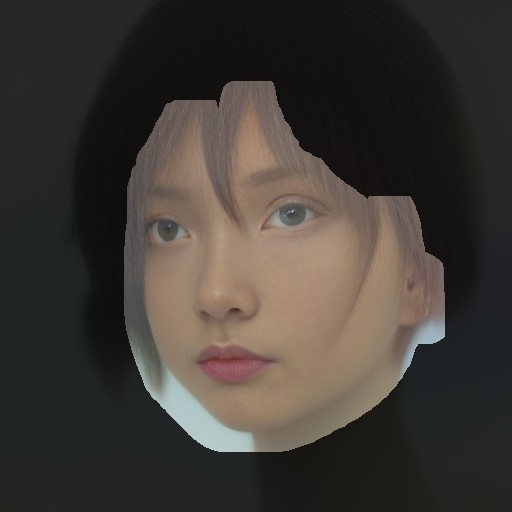
</details>

### Completed
<details>
<summary>Show sample image</summary>


</details>

## Parameters
### Basic Options
##### Workflow
Select a workflow. "Search workflows in subdirectories" can be enabled in the Face Editor section of the "Settings" tab to try some experimental workflows. You can also add your own workflows.

For more detailed information, please refer to the [Workflow Editor](#workflow-editor) section.

##### Use minimal area (for close faces)
When pasting the generated image to its original location, the rectangle of the detected face area is used. If this option is not enabled, the generated image itself is pasted. In other words, enabling this option applies a smaller face image, while disabling it applies a larger face image.

##### Save original image
This option allows you to save the original, unmodified image.

##### Show original image
This option allows you to display the original, unmodified image.

##### Show intermediate steps
This option enables the display of images that depict detected faces and masks.
If the generated image is unnatural, enabling it may reveal the cause.

##### Prompt for face
Prompt for generating a new face.
If this parameter is not specified, the prompt entered at the top of the screen is used.

For more information, please see: [here](#change-facial-expression).


##### Mask size (0-64)
Size of the mask area when inpainting to blend the new face with the whole image.

<details>
<summary>Show sample images</summary>

**size: 0**


**size: 10**


**size: 20**
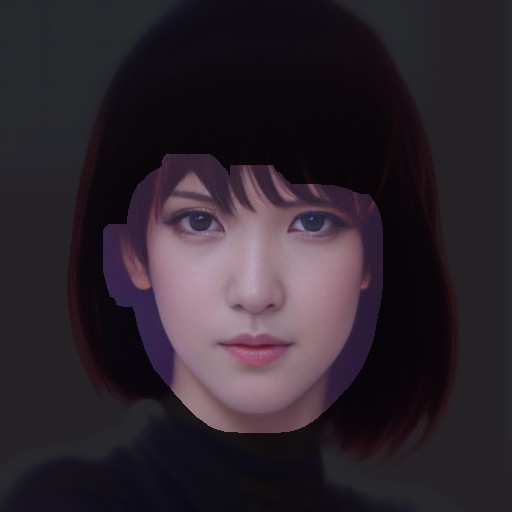
</details>


##### Mask blur (0-64)
Size of the blur area when inpainting to blend the new face with the whole image.


---
### Advanced Options
#### Step 1. Face Detection
##### Maximum number of faces to detect (1-20)
Use this parameter when you want to reduce the number of faces to be detected.
If more faces are found than the number set here, the smaller faces will be ignored.

##### Face detection confidence (0.7-1.0)
Confidence threshold for face detection. Set a lower value if you want to detect more faces.

#### Step 2. Crop and Resize the Faces
##### Face margin (1.0-2.0)
Specify the size of the margin for face cropping by magnification.

If other parameters are exactly the same but this value is different, the atmosphere of the new face created will be different.

<details>
<summary>Show sample images</summary>

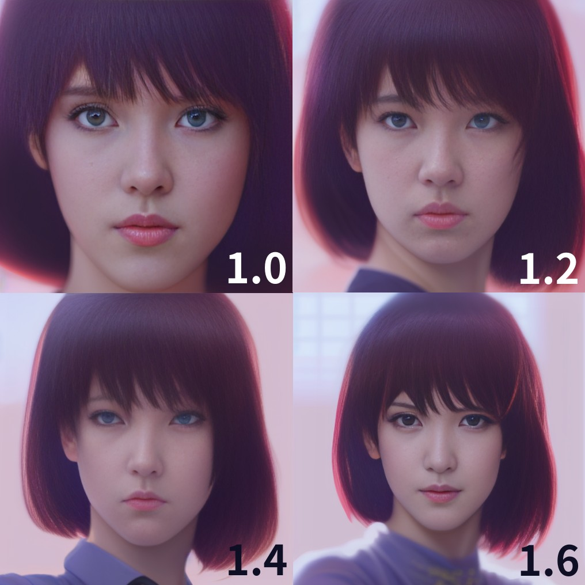
</details>


##### Size of the face when recreating 
Specifies one side of the image size when creating a face image. Normally, there should be no need to change this from the default value (512), but you may see interesting changes if you do.

##### Ignore faces larger than specified size
Ignore if the size of the detected face is larger than the size specified in "Size of the face when recreating".

For more information, please see: [here](https://github.com/ototadana/sd-face-editor/issues/65).

##### Upscaler
Select the upscaler to be used to scale the face image.

#### Step 3. Recreate the Faces
##### Denoising strength for face images (0.1-0.8)
Denoising strength for generating a new face.
If the value is too small, facial collapse cannot be corrected, but if it is too large, it is difficult to blend with the entire image.

<details>
<summary>Show sample images</summary>

**strength: 0.4**
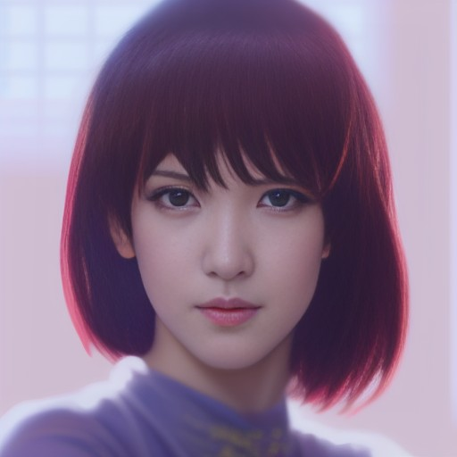

**strength: 0.6**
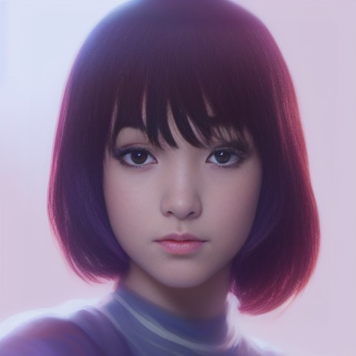

**strength: 0.8**

</details>


##### Tilt adjustment threshold (0-180)
This option defines the angle, in degrees, above which tilt correction will be automatically applied to detected faces. For instance, if set to 20, any face detected with a tilt greater than 20 degrees will be adjusted. However, if the "Adjust tilt for detected faces" option in the Face Editor section of the "Settings" tab is enabled, tilt correction will always be applied, regardless of the tilt adjustment threshold value.

#### Step 4. Paste the Faces
##### Apply inside mask only
Paste an image cut out in the shape of a face instead of a square image.

For more information, please see: [here](https://github.com/ototadana/sd-face-editor/issues/33).

#### Step 5. Blend the entire image
##### Denoising strength for the entire image (0.0-1.0)
Denoising strength when inpainting to blend the new face with the whole image.
If the border lines are too prominent, increase this value.

---
## API
If you want to use this script as an extension (alwayson_scripts) in the [API](https://github.com/AUTOMATIC1111/stable-diffusion-webui/wiki/API), specify **"face editor ex"** as the script name as follows:

```
   "alwayson_scripts": {
      "face editor ex": {
         "args": [{"prompt_for_face": "smile"}]
      },
```

By specifying an **object** as the first argument of args as above, parameters can be specified by keywords. We recommend this approach as it can minimize the impact of modifications to the software. If you use a script instead of an extension, you can also specify parameters in the same way as follows:

```
   "script_name": "face editor",
   "script_args": [{"prompt_for_face": "smile"}],
```

- See [source code](https://github.com/ototadana/sd-face-editor/blob/main/scripts/entities/option.py) for available keywords.

---
## Workflow Editor
Workflow Editor is where you can customize and experiment with various options beyond just the standard settings. 

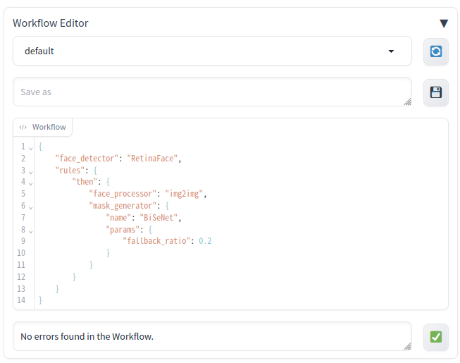

- The editor allows you to select from a variety of implementations, each offering unique behaviors compared to the default settings.
- It provides a platform for freely combining these implementations, enabling you to optimize the workflow according to your needs.
- Within this workflow, you will define a combination of three components: the "Face Detector" for identifying faces within an image, the "Face Processor" for adjusting the detected faces, and the "Mask Generator" for integrating the processed faces back into the original image.
- As you experiment with different settings, ensure to activate the "Show intermediate steps" option. This allows you to understand precisely the impact of each modification.

### Using the Workflow Editor UI
#### Workflow list and Refresh button


- Lists workflow definition files (.json) stored in the [workflows](workflows) folder.
- The option "Search workflows in subdirectories" can be enabled in the Face Editor section of the "Settings" tab to use sample workflow definition files.
- The Refresh button (🔄) can be clicked to update the contents of the list.

#### File name and Save button


- This feature is used to save the edited workflow definition.
- A file name can be entered in the text box and the Save button (💾) can be clicked to save the file.

#### Workflow definition editor and Validation button
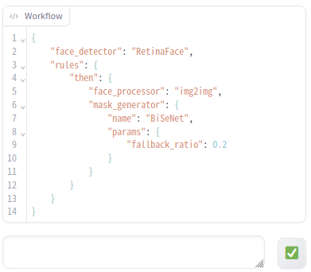

- This feature allows you to edit workflow definitions. Workflows are described in JSON format.
- The Validation button (✅) can be clicked to check the description. If there is an error, it will be displayed in the message area to the left of the button.

## Example Workflows

This project includes several example workflows to help you get started. Each example provides a JSON definition for a specific use case, which can be used as is or customized to suit your needs. To access these example workflows from the Workflow Editor, you need to enable the "Search workflows in subdirectories" option located in the Face Editor section of the "Settings" tab.


For more details about these example workflows and how to use them, please visit the [workflows/examples/README.md](workflows/examples/README.md).


## Workflow Components (Inferencers)

In this project, the components used in the workflow are also referred to as "inferencers". These inferencers are part of the process that modifies the faces in the generated images:

1. **Face Detectors:** These components are used to identify and locate faces within an image. They provide the coordinates of the detected faces, which will be used in the following steps.
2. **Face Processors:** Once the faces are detected and cropped, these components modify or enhance the faces.
3. **Mask Generators:** After the faces have been processed, these components are used to create a mask. The mask defines the area of the image where the modifications made by the Face Processors will be applied.

The "General components" provide the basic functionalities for these categories, and they can be used without the need for additional software installations. On the other hand, each functionality can also be achieved by different technologies or methods, which are categorized here as "Additional components". These "Additional components" provide more advanced or specialized ways to perform the tasks of face detection, face processing, and mask generation.

In this project, the components used in the workflow are also referred to as "inferencers". These inferencers fall into three functional categories: Face Detectors, Face Processors, and Mask Generators.

> **Note:** When using "Additional components", ensure that the features you want to use are enabled in the "Additional Components" section of the "Settings" tab under "Face Editor". For detailed descriptions and usage of each component, please refer to the corresponding README.

### General components
- [General components](scripts/inferencers/README.md)

### Additional components
- [Anime Segmentation components](scripts/inferencers/anime_segmentation/README.md)
- [InsightFace components](scripts/inferencers/insightface/README.md)
- [Mediapipe components](scripts/inferencers/mediapipe/README.md)
- [YOLO components](scripts/inferencers/yolo/README.md)


### Workflow JSON Reference

- `face_detector` (string or object, required): The face detector component to be used in the workflow.
  - When specified as a string, it is considered as the `name` of the face detector implementation.
  - When specified as an object:
    - `name` (string, required): The name of the face detector implementation.
    - `params` (object, optional): Parameters for the component, represented as key-value pairs.
- `rules` (array or object, required): One or more rules to be applied.
  - Each rule can be an object that consists of `when` and `then`:
    - `when` (object, optional): The condition for the rule.
      - `tag` (string, optional): A tag corresponding to the type of face detected by the face detector. This tag can optionally include a query following the tag name, separated by a '?'. This query is a complex condition that defines attribute-value comparisons using operators. The query can combine multiple comparisons using logical operators. For example, a tag could be "face?age<30&gender=M", which means that the tag name is "face" and the query is "age<30&gender=M". The query indicates that the rule should apply to faces that are identified as male and are less than 30 years old.
      - The available operators are as follows:
         - `=`: Checks if the attribute is equal to the value.
         - `<`: Checks if the attribute is less than the value.
         - `>`: Checks if the attribute is greater than the value.
         - `<=`: Checks if the attribute is less than or equal to the value.
         - `>=`: Checks if the attribute is greater than or equal to the value.
         - `!=`: Checks if the attribute is not equal to the value.
         - `~=`: Checks if the attribute value contains the value.
         - `*=`: Checks if the attribute value starts with the value.
         - `=*`: Checks if the attribute value ends with the value.
         - `~*`: Checks if the attribute value does not contain the value.
      - The logical operators are as follows:
         - `&`: Represents logical AND.
         - `|`: Represents logical OR.
      - `criteria` (string, optional): This determines which faces will be processed, based on their position or size. Available options for position include 'left', 'right', 'center', 'top', 'middle', 'bottom'. For size, 'small', 'large' are available. The selection of faces to be processed that match the specified criteria can be defined in this string, following the pattern `{position/size}:{index range}`. The `{index range}` can be a single index, a range of indices, or a combination of these separated by a comma. For example, specifying left:0 will process the face that is located the most to the left on the screen. left:0-2 will process the three faces that are the most left, and left:0,2,5 will process the most left face, the third from the left, and the sixth from the left. If left is specified without an index or range, it will default to processing the face most left in the frame. Essentially, this is the same as specifying left:0.
    - `then` (object or array of objects, required): The job or list of jobs to be executed if the `when` condition is met.
      - Each job is an object with the following properties:
        - `face_processor` (object or string, required): The face processor component to be used in the job.
          - When specified as a string, it is considered as the `name` of the face processor implementation.
          - When specified as an object:
            - `name` (string, required): The name of the face processor implementation.
            - `params` (object, optional): Parameters for the component, represented as key-value pairs.
        - `mask_generator` (object or string, required): The mask generator component to be used in the job.
          - When specified as a string, it is considered as the `name` of the mask generator implementation.
          - When specified as an object:
            - `name` (string,  required): The name of the mask generator implementation.
            - `params` (object, optional): Parameters for the component, represented as key-value pairs.
  
Rules are processed in the order they are specified. Once a face is processed by a rule, it will not be processed by subsequent rules. The last rule can be specified with `then` only (i.e., without `when`), which will process all faces that have not been processed by previous rules.

---
## Settings

In the "Face Editor" section of the "Settings" tab, the following settings can be configured.

### "Search workflows in subdirectories"

**Overview**  
"Search workflows in subdirectories" is a setting option that controls whether Face Editor includes subdirectories in its workflow search.

**Value and Impact**  
The value is a boolean, with either `True` or `False` to be specified. The default value is `False`, which indicates that the search does not include subdirectories. When set to `True`, the workflow search extends into subdirectories, allowing for the reference of sample workflows.

---

### "Additional components"

**Overview**  
"Additional components" is a setting option that specifies the additional components available for use in Face Editor.

**Value and Impact**  
This setting is a series of checkboxes labeled with component names. Checking a box (setting to Enabled) activates the corresponding component in Face Editor.

---

### "Save original image if face detection fails"

**Overview**  
"Save original image if face detection fails" is a setting option that specifies whether to save the original image if face detection fails.

**Value and Impact**  
The value is a boolean, with either `True` or `False` to be specified. The default value is `True`, which means that the original image will be saved if face detection fails.

---

### "Adjust tilt for detected faces"

**Overview**  
"Adjust tilt for detected faces" is a setting option that specifies whether to adjust the tilt for detected faces.

**Value and Impact**  
The value is a boolean, with either `True` or `False` to be specified. The default value is `False`, indicating that no tilt correction will be applied when a face is detected. Even when "Adjust tilt for detected faces" is not enabled, the tilt correction may still be applied based on the "Tilt adjustment threshold" setting.

---

### "The position in postprocess at which this script will be executed"

**Overview**  
"The position in postprocess at which this script will be executed" is a setting option that specifies the position at which this script will be executed during postprocessing.

**Value and Impact**  
The value is an integer, with a value from 0 to 99 to be specified. A smaller value means that the script will be executed earlier. The default value is `99`, which indicates that this script will likely be executed last during postprocessing.


---
## Contribution

We warmly welcome contributions to this project! If you're someone who is interested in machine learning, face processing, or just passionate about open-source, we'd love for you to contribute. 

### What we are looking for:
- **Workflow Definitions:** Help us expand our array of workflow definitions. If you have a unique or interesting workflow design, please don't hesitate to submit it as a sample!
- **Implementations of `FaceDetector`, `FaceProcessor`, and `MaskGenerator`:** If you have alternative approaches or models for any of these components, we'd be thrilled to include your contributions in our project.

Before starting your contribution, please make sure to check out our existing code base and follow the general structure. If you have any questions, don't hesitate to open an issue. We appreciate your understanding and cooperation.

We're excited to see your contributions and are always here to help or provide guidance if needed. Happy coding!
