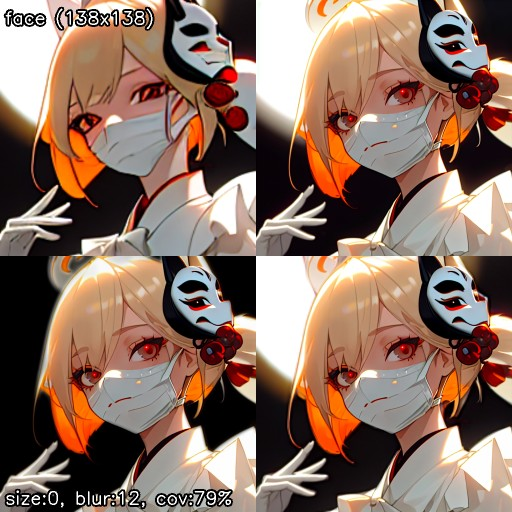

# Anime Segmentation components
Component implementation using [Anime Segmentation](https://github.com/SkyTNT/anime-segmentation) model from the [Hugging Face Model Hub](https://huggingface.co/skytnt/anime-seg).

To use the following components, please enable 'anime_segmentation' option under "Additional components" in the Face Editor section of the "Settings" tab. 

## 1. Mask Generator
This utilizes the [Anime Segmentation](https://github.com/SkyTNT/anime-segmentation) model to generate masks specifically designed for anime images.

#### Name
- AnimeSegmentation

#### Implementation
- [AnimeSegmentationMaskGenerator](mask_generator.py)

#### Recognized UI settings
- N/A

#### Configuration Parameters (in JSON)
- N/A

