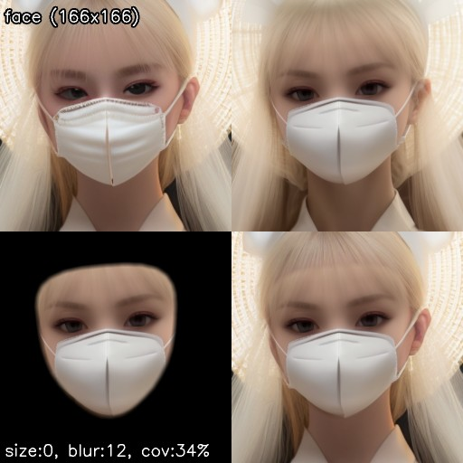

# Mediapipe components
Component implementation using [MediaPipe](https://developers.google.com/mediapipe).

To use the following components, please enable 'mediapipe' option under "Additional components" in the Face Editor section of the "Settings" tab.

## 1. Face Detector
A Face Detector implemented using [the face detection feature of MediaPipe](https://developers.google.com/mediapipe/solutions/vision/face_detector).

#### Name
- MediaPipe

#### Implementation
- [MediaPipeFaceDetector](face_detector.py)

#### Recognized UI settings
- N/A

#### Configuration Parameters (in JSON)
- `conf` (float, optional, default: 0.01): The confidence threshold for face detection. This specifies the minimum confidence for a face to be detected. The higher this value, the fewer faces will be detected, and the lower this value, the more faces will be detected.

#### Returns
- tag: "face"
- attributes: N/A
- landmarks: 5 (both eyes, the nose, and the center of the mouth)

#### Usage in Workflows
- [mediapipe.json](../../../workflows/examples/mediapipe.json)

---

## 2. Mask Generator
This mask generator uses the MediaPipe Face Mesh model to generate masks. It identifies a set of facial landmarks and interpolates these to create a mask.

#### Name
- MediaPipe

#### Implementation
- [MediaPipeMaskGenerator](mask_generator.py)

#### Recognized UI settings
- Use minimal area (for close faces)
- Mask size

#### Configuration Parameters (in JSON)
- `use_convex_hull` (boolean, default: True): If set to True, the mask is created based on the convex hull (the smallest convex polygon that contains all the points) of the facial landmarks. This can help to create a more uniform and regular mask shape. If False, the mask is directly based on the face landmarks, possibly leading to a more irregular shape.
- `dilate_size` (integer, default: -1): Determines the size of the morphological dilation and erosion processes. These operations can adjust the mask size and smooth its edges. If set to -1, the dilation size will be automatically set to 0 if `use_convex_hull` is True, or 40 if `use_convex_hull` is False.
- `conf` (float, default: 0.01): Confidence threshold for the MediaPipe Face Mesh model. Any landmarks detected with a confidence lower than this value will be ignored during mask generation.

#### Usage in Workflows
- [mediapipe.json](../../../workflows/examples/mediapipe.json)

