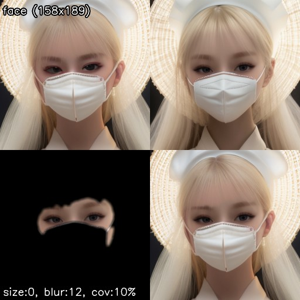

# OpenMMLab components
Component implementation using [OpenMMLab](https://openmmlab.com/).

To use this, please enable 'openmmlab' option under "Additional components" in the Face Editor section of the "Settings" tab. 

## 1. Mask Generator
This component utilizes a [Occlusion-aware face segmentation model](https://huggingface.co/ototadana/occlusion-aware-face-segmentation) for mask generation. Because the model is trained by [High-Quality Synthetic Face Occlusion Segmentation Datasets](https://github.com/kennyvoo/face-occlusion-generation), if a face is covered by another object, such as a hand or mask, it can be excluded and the facial segment can be extracted.

#### Name
- MMSeg

#### Implementation
- [MMSegMaskGenerator](mmseg_mask_generator.py)

#### Recognized UI settings
- Use minimal area (for close faces)
- Mask size

#### Usage in Workflows
- [openmmlab.json](../../../workflows/examples/openmmlab.json)
